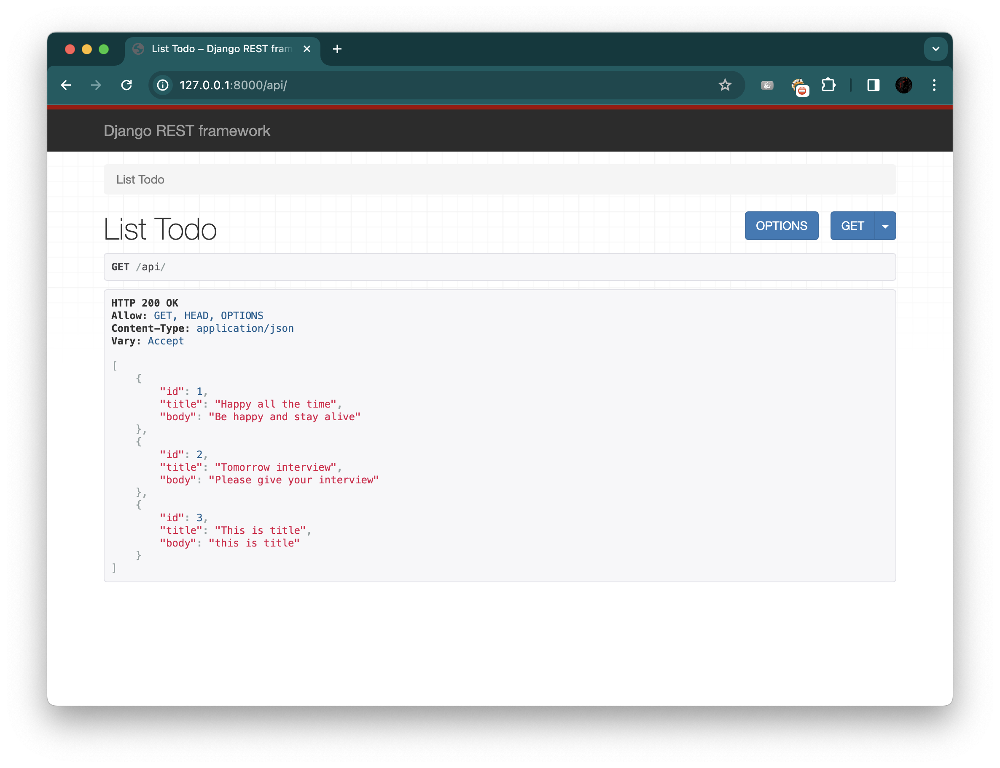

# Django Notes

Creating a Django project

```bash
python3 -m venv venv #creating virtual environment
source venv/bin/activate #activating the environment
pip3 install django #installing django
django-admin startproject project_name .
```

To sync the database with default settings

```bash
python3 manage.py migrate
python3 manage.py runserver
```

# Project 1 : Library Website

* Setup the django Project
* Create a new app name "books"
```bash
python3 manage.py startapp books
```
* Add your app to the INSTALLED_APPS
```python
# django_project/settings.py
INSTALLED_APPS = [
    "django.contrib.admin",
    "django.contrib.auth",
    "django.contrib.contenttypes",
    "django.contrib.sessions",
    "django.contrib.messages",
    "django.contrib.staticfiles",
    # Local
    "books.apps.BooksConfig",  # new
]
```

## Models
```python
# books/models.py
from django.db import models

class Book(models.Model):
    title = models.CharField(max_length=250) subtitle = models.CharField(max_length=250) author = models.CharField(max_length=100) isbn = models.CharField(max_length=13)

    def __str__(self):
        return self.title
```

Now add this changes to database

```bash
python3 manage.py makemigrations books
```

## Admin

Creating superuser account

```bash
python3 manage.py createsuperuser
```

Now registering the superuser

```python
# books/admin.py
from django.contrib import admin
from .models import Book
admin.site.register(Book)
```

Run the server

```bash
python3 manage.py runserver
```

You can check the admin panel at `http://127.0.0.1:8000/admin`.

Add some book by Clicking '+'.

## Views

The views.py file controls how the database model content is displayed.

```python
# books/views.py
from django.views.generic
import ListView from .models import Book

class BookListView(ListView):
    model = Book
    template_name = "book_list.html"
```

## URLs

Adding URLs to both project-level.

```python
# django_project/urls.py
from django.contrib import admin
from django.urls import path, include # new
urlpatterns = [
    path("admin/", admin.site.urls),
    path("", include("books.urls")),  # new
]
```

Now in books

```python
# books/urls.py
from django.urls import path
from .views import BookListView
urlpatterns = [
    path("", BookListView.as_view(), name="home"),
]
```

## Templates

The final step is to create our template file that controls the layout on the actual web page.

```bash
mkdir books/templates
mkdir books/templates/books
```

```django
<!-- books/templates/books/book_list.html -->
<h1>All books</h1>
 <ul>
<li>Title: {{ book.title }}</li> <li>Subtitle: {{ book.subtitle }}</li> <li>Author: {{ book.author }}</li> <li>ISBN: {{ book.isbn }}</li>
</ul>

```

Runserver

```bash
py manage.py runserver
```

## Tests

Tests are a vital part of writing software and we should add them now before moving on to the API portion of this project.

```python
# books/tests.py
from django.test import TestCase
from django.urls import reverse
from .models import Book
class BookTests(TestCase):
    @classmethod
    def setUpTestData(cls):
        cls.book = Book.objects.create(
                    title="A good title",
                    subtitle="An excellent subtitle",
                    author="Tom Christie",
                    isbn="1234567890123",
        )
        
        def test_book_content(self):
            self.assertEqual(self.book.title, "A good title")
            self.assertEqual(self.book.subtitle, "An excellent subtitle")
            self.assertEqual(self.book.author, "Tom Christie")
            self.assertEqual(self.book.isbn, "1234567890123")
        
        def test_book_listview(self):
            response = self.client.get(reverse("home"))
            self.assertEqual(response.status_code, 200)
            self.assertContains(response, "excellent subtitle")
            self.assertTemplateUsed(response, "books/book_list.html")
```

Run Tests
```shell
py manage.py test
```

# Creating the Api

* Drf library suitable for creating api in django
```bash
pip install djangorestframework
```
* Add to `INSTALLED_APPS`

```python
# django_project/settings.py
INSTALLED_APPS = [
    "django.contrib.admin",
    "django.contrib.auth",
    "django.contrib.contenttypes",
    "django.contrib.sessions",
    "django.contrib.messages",
    "django.contrib.staticfiles",
    # 3rd party
    "rest_framework",  # new
    # Local
    "books.apps.BooksConfig",
]
```

* Creating a new app apis
```bash
py manage.py startapp apis
```

* Add to `INSTALLED_APPS`
```python
# django_project/settings.py
INSTALLED_APPS = [
    "django.contrib.admin",
    "django.contrib.auth",
    "django.contrib.contenttypes",
    "django.contrib.sessions",
    "django.contrib.messages",
    "django.contrib.staticfiles",
    # 3rd party
    "rest_framework",
    # Local
    "books.apps.BooksConfig",
    "apis.apps.ApisConfig",  # new
]
```

## URLs

Adding url to both the project-level

```python
# django_project/urls.py
from django.contrib import admin
from django.urls import path, include
urlpatterns = [
    path("admin/", admin.site.urls),
    path("api/", include("apis.urls")),  # new
    path("", include("books.urls")),
]
```

Now in apis

```python
# apis/urls.py
from django.urls import path
from .views import BookAPIView
urlpatterns = [
    path("", BookAPIView.as_view(), name="book_list"),
]
```

## Views

Django REST Framework views are similar except the end result is serialized data in JSON format, not the content for a web page!

```python
# apis/views.py
from rest_framework import generics from books.models import Book
from .serializers import BookSerializer
class BookAPIView(generics.ListAPIView): queryset = Book.objects.all() serializer_class = BookSerializer
```

## Serializers

A serializer33 translates complex data like querysets and model instances into a format that is easy to consume over the internet, typically JSON.
```python
# apis/serializers.py
from rest_framework import serializers from books.models import Book
class BookSerializer(serializers.ModelSerializer): class Meta:
        model = Book
        fields = ("title", "subtitle", "author", "isbn")
```

## Browsable API

Raw JSON data is not particularly friendly to consume with human eyes. Fortunately, Django REST Framework ships with a built-in browsable API that displays both the content and HTTP verbs associated with a given endpoint.

```shell
python manage.py runserver
```

## Tests

```python
# apis/tests.py
from django.urls import reverse
from rest_framework import status
from rest_framework.test import APITestCase
from books.models import Book

class APITests(APITestCase):
    @classmethod
    def setUpTestData(cls):
        cls.book = Book.objects.create(
                    title="Django for APIs",
                    subtitle="Build web APIs with Python and Django",
                    author="William S. Vincent",
                    isbn="9781735467221",
        )
        
    def test_api_listview(self):
        response = self.client.get(reverse("book_list"))
        self.assertEqual(response.status_code, status.HTTP_200_OK)
        self.assertEqual(Book.objects.count(), 1)
        self.assertContains(response, self.book)
```

For running all the test case.
```shell
python manage.py test
```

For running particular app test case.
```shell
python manage.py test apis
```

## Static Files

Creating static folder
```shell
mkdir static
```

Installing whitenoise
```shell
pip install whitenoise
```

Setup the whitenoise
```python
# django_project/settings.py
INSTALLED_APPS = [
    ...
    "whitenoise.runserver_nostatic",  # new
    "django.contrib.staticfiles",
]
MIDDLEWARE = [
    "django.middleware.security.SecurityMiddleware",
    "django.contrib.sessions.middleware.SessionMiddleware",
    "whitenoise.middleware.WhiteNoiseMiddleware",  # new
    ...
]
STATIC_URL = "/static/"
STATICFILES_DIRS = [BASE_DIR / "static"]  # new
STATIC_ROOT = BASE_DIR / "staticfiles"  # new
STATICFILES_STORAGE =
"whitenoise.storage.CompressedManifestStaticFilesStorage" # new
```

First time to compile all the static file directories and files into one self-contained unit suitable for deployment.
```shell
py manage.py collectstatic
```

# Project 2: ToDoAPI

* Setup the django Project
* Create a new app name "books"
```bash
python3 manage.py startapp todos
```
* Add your app to the INSTALLED_APPS
```python
# django_project/settings.py
INSTALLED_APPS = [
    "django.contrib.admin",
    "django.contrib.auth",
    "django.contrib.contenttypes",
    "django.contrib.sessions",
    "django.contrib.messages",
    "django.contrib.staticfiles",
    # Local
    "todos.apps.TodosConfig",  # new
]
```

## Models
```python
# todos/models.py
from django.db import models
class Todo(models.Model):
    title = models.CharField(max_length=200) body = models.TextField()

    def __str__(self):
        return self.title
```

Now add this changes to database

```bash
python3 manage.py makemigrations todos
python3 manage.py migrate
```

Now registering the superuser

```python
# todos/admin.py
from django.contrib import admin
from .models import Todo

class TodoAdmin(admin.ModelAdmin):
    list_display = (
    "title",
    "body",
    )
admin.site.register(Todo, TodoAdmin)
```

Creating superuser account
```bash
python3 manage.py createsuperuser
```

Run the server

```bash
python3 manage.py runserver
```

You can check the admin panel at `http://127.0.0.1:8000/admin`.

Log in and click on “+ Add” next to Todos. Create 3 new todo items, making sure to add a title and body for both. Here’s what mine looks like:

## Tests

```python
# todos/tests.py
from django.test import TestCase from .models import Todo
class TodoModelTest(TestCase):
    @classmethod
    def setUpTestData(cls):
        cls.todo = Todo.objects.create(
                    title="First Todo",
                    body="A body of text here"
                )

    def test_model_content(self):
        self.assertEqual(self.todo.title, "First Todo")
        self.assertEqual(self.todo.body, "A body of text here")
        self.assertEqual(str(self.todo), "First Todo")
```

Run Tests
```shell
python manage.py test
```

## Django REST Framework

```shell
python3 -m pip install djangorestframework
```

AllowAny* allows unrestricted access re-gardless of whether a request was authenticated or not. 

```python
# django_project/settings.py
INSTALLED_APPS = [
    "django.contrib.admin",
    "django.contrib.auth",
    "django.contrib.contenttypes",
    "django.contrib.sessions",
    "django.contrib.messages",
    "django.contrib.staticfiles",
    # 3rd party
    "rest_framework",  # new
    # Local
    "todos.apps.TodosConfig",
]
REST_FRAMEWORK = {
    "DEFAULT_PERMISSION_CLASSES": [
        "rest_framework.permissions.AllowAny",
    ],
}
```

## URLs

```python
# django_project/urls.py
from django.contrib import admin
from django.urls import path, include
# new
urlpatterns = [
    path("admin/", admin.site.urls),
    path("api/", include("todos.urls")),  # new
]
```

create an app-level todos/urls.py file 
```python
# todos/urls.py
from django.urls import path
from .views import ListTodo, DetailTodo
urlpatterns = [
    path("<int:pk>/", DetailTodo.as_view(), name="todo_detail"),
    path("", ListTodo.as_view(), name="todo_list"),
]
```

## Serializers

```python
# todos/serializers.py
from rest_framework import serializers
from .models import Todo
class TodoSerializer(serializers.ModelSerializer):
    class Meta:
        model = Todo
        fields = (
            "id",
            "title",
            "body",
)
```

## Views

**ListAPIView** to display all todos and **RetrieveAPIView** to display a single model instance.

```python
# todos/views.py
from rest_framework import generics
from .models import Todo
from .serializers import TodoSerializer

class ListTodo(generics.ListAPIView):
    queryset = Todo.objects.all()
    serializer_class = TodoSerializer

class DetailTodo(generics.RetrieveAPIView):
    queryset = Todo.objects.all() 
    serializer_class = TodoSerializer
```

## Browsable API

Navigate to `https://127.0.0.1:8000/api`



Navigate to `http://127.0.0.1:8000/api/1/.`

and so on..

## API Tests

```python
# todos/tests.py
from django.test import TestCase
from django.urls import reverse # new
from rest_framework import status # new
from rest_framework.test import APITestCase # new
from .models import Todo
class TodoModelTest(TestCase): @classmethod
def setUpTestData(cls):
cls.todo = Todo.objects.create(
            title="First Todo",
            body="A body of text here"
        )
def test_model_content(self):
    self.assertEqual(self.todo.title, "First Todo")
    self.assertEqual(self.todo.body, "A body of text here")
    self.assertEqual(str(self.todo), "First Todo")

def test_api_listview(self): # new
    response = self.client.get(reverse("todo_list"))
    self.assertEqual(response.status_code, status.HTTP_200_OK)
    self.assertEqual(Todo.objects.count(), 1)
    self.assertContains(response, self.todo)

    def test_api_detailview(self): # new 
        response = self.client.get(
            reverse("todo_detail", 
            kwargs={"pk": self.todo.id}),
            format="json")
        self.assertEqual(response.status_code, status.HTTP_200_OK)
        self.assertEqual(Todo.objects.count(), 1)
        self.assertContains(response, "First Todo")
```

Run `python3 manage.py test`

## CORS

Cross-Origin Resource Sharing (CORS)59 refers to the fact that whenever a client interacts with an API hosted on a different domain (mysite.com vs yoursite.com) or port (localhost:3000 vs localhost:8000) there are potential security issues.

`pip install django-cors-headers` installing cors.

Adding CORS to setting

```python
# django_project/settings.py
INSTALLED_APPS = [
    "django.contrib.admin",
    "django.contrib.auth",
    "django.contrib.contenttypes",
    "django.contrib.sessions",
    "django.contrib.messages",
    "django.contrib.staticfiles",
    # 3rd party
    "rest_framework",
    "corsheaders",  # new
    # Local
    "todos.apps.TodosConfig",
]
MIDDLEWARE = [
    "django.middleware.security.SecurityMiddleware",
    "django.contrib.sessions.middleware.SessionMiddleware",
    "corsheaders.middleware.CorsMiddleware",  # new
    "django.middleware.common.CommonMiddleware",
    "django.middleware.csrf.CsrfViewMiddleware",
    "django.contrib.auth.middleware.AuthenticationMiddleware",
    "django.contrib.messages.middleware.MessageMiddleware",
    "django.middleware.clickjacking.XFrameOptionsMiddleware",
]
CORS_ALLOWED_ORIGINS = (
    "http://localhost:3000",
    "http://localhost:8000",
)
```

## CSRF

At the bottom of the settings.py file, next to CORS_ORIGIN_WHITELIST, add this additional line for React’s default local port of 3000:

```python
# django_project/settings.py
CSRF_TRUSTED_ORIGINS = ["localhost:3000"]
```
And that’s it! Our back-end is now complete and capable of communicating with any front-end that uses port 3000. If our front-end of choice dictates a different port that can easily be updated in our code.

## Static

```shell
mkdir static
python -m pip install whitenoise
```

```python
# django_project/settings.py
INSTALLED_APPS = [
    ...
    "whitenoise.runserver_nostatic",  # new
    "django.contrib.staticfiles",
]
MIDDLEWARE = [
    "django.middleware.security.SecurityMiddleware",
    "django.contrib.sessions.middleware.SessionMiddleware",
    "whitenoise.middleware.WhiteNoiseMiddleware",  # new
    "corsheaders.middleware.CorsMiddleware",
    ...
]

# At static position
STATIC_URL = "/static/"
     
Chapter 5: Todo API 86
STATICFILES_DIRS = [BASE_DIR / "static"]  # new
STATIC_ROOT = BASE_DIR / "staticfiles"  # new
STATICFILES_STORAGE =
"whitenoise.storage.CompressedManifestStaticFilesStorage" # new
```

Collect static `python manage.py collectstatic`

# Project 3: blogAPI

## Initial Setup

```shell
# Windows
> cd onedrive\desktop\code
> mkdir blogapi
> cd blogapi
> python -m venv .venv
> .venv\Scripts\Activate.ps1
(.venv) > python -m pip install django
(.venv) > django-admin startproject django_project .
# macOS
% cd desktop/desktop/code
% mkdir blogapi
% cd blogapi
% python3 -m venv .venv
% source .venv/bin/activate
(.venv) % python3 -m pip install django
(.venv) % django-admin startproject django_project .
```

## Custom User Model

Create new app `python manage.py startapp accounts`.

```python
# django_project/settings.py
INSTALLED_APPS = [
    "django.contrib.admin",
    "django.contrib.auth",
    "django.contrib.contenttypes",
    "django.contrib.sessions",
    "django.contrib.messages",
    "django.contrib.staticfiles",
    # Local
    "accounts.apps.AccountsConfig",  # new
]
```

```python
# accounts/models.py
from django.contrib.auth.models import AbstractUser
from django.db import models

class CustomUser(AbstractUser):
    name = models.CharField(null=True, blank=True, max_length=100)
```

Add this to at bottom of the settings.py
```python
# django_project/settings.py
AUTH_USER_MODEL  = "accounts.CustomUser"  # new
```

```bash
(.venv) > python manage.py makemigrations
(.venv) > python manage.py migrate
(.venv) > python manage.py createsuperuser
```

```shell
python manage.py runserver
```
Run the server and go to `http://127.0.0.1:8000/admin/ `

Only the Groups section appears. We don’t have Users as we normally would with the default User model. What’s missing is two things: we have to customize accounts/admin.py to display our new custom user model and create a new file called accounts/forms.py that sets CustomUser to be used when creating or changing users. We’ll start with account/forms.py.

```python
# accounts/forms.py
from django.contrib.auth.forms import UserCreationForm, UserChangeForm
from .models import CustomUser

class CustomUserCreationForm(UserCreationForm):
     class Meta(UserCreationForm):
        model = CustomUser
        fields = UserCreationForm.Meta.fields + ("name",)
        
class CustomUserChangeForm(UserChangeForm): 
    class Meta:
        model = CustomUser
        fields = UserChangeForm.Meta.fields
```

The last step in the custom user setup is to update accounts/admin.py to properly display the new custom user.

```python
# accounts/admin.py
from django.contrib import admin
from django.contrib.auth.admin import UserAdmin

from .forms import CustomUserCreationForm, CustomUserChangeForm
from .models import CustomUser

# Register your models here.
class CustomUserAdmin(UserAdmin):
    add_form = CustomUserCreationForm
    form = CustomUserChangeForm
    model = CustomUser
    list_display = [
        'email',
        'username',
        'name',
        'is_staff',
    ]
    fieldsets = UserAdmin.fieldsets + ((None, {"fields": ('name',)}),)
    add_fieldsets = UserAdmin.add_fieldsets + ((None, {"fields": ('name',)}),)
```

And we’re done. If you reload the admin page it now displays Users.

## Posts App

```shell
(.venv) > python manage.py startapp posts
```

```python
# django_project/settings.py
INSTALLED_APPS = [
    "django.contrib.admin",
    "django.contrib.auth",
    "django.contrib.contenttypes",
    "django.contrib.sessions",
    "django.contrib.messages",
    "django.contrib.staticfiles",
    # Local
    "accounts.apps.AccountsConfig",
    "posts.apps.PostsConfig",  # new
]
```

## Post Model

```python
# posts/models.py
from django.conf import settings 
from django.db import models

class Post(models.Model):
    title = models.CharField(max_length=50)
    body = models.TextField()
    author = models.ForeignKey(settings.AUTH_USER_MODEL,on_delete=models.CASCADE)
    created_at = models.DateTimeField(auto_now_add=True)
    updated_at = models.DateTimeField(auto_now=True)
    
    def __str__(self):
        return self.title
```

Making migrations in Posts app
```shell
(.venv) > python manage.py makemigrations posts
(.venv) > python manage.py migrate
```

Add some post to using `http://127.0.0.1:8000/admin/ `

## Tests

```python
# posts/tests.py
from django.contrib.auth import get_user_model
from django.test import TestCase
from .models import Post
class BlogTests(TestCase):
    @classmethod
    def setUpTestData(cls):
        cls.user = get_user_model().objects.create_user(
                    username="testuser",
                    email="test@email.com",
                    password="secret",
        )
        cls.post = Post.objects.create(
                    author=cls.user,
                    title="A good title",
                    body="Nice body content",
        )

    def test_post_model(self):
        self.assertEqual(self.post.author.username, "testuser")
        self.assertEqual(self.post.title, "A good title")
        self.assertEqual(self.post.body, "Nice body content")
        self.assertEqual(str(self.post), "A good title")
```

```shell
(.venv) > python manage.py test
```

## Django Rest Framework

```shell
(.venv) > python -m pip install djangorestframework
```

Setting up drf.
```python
# django_project/settings.py
INSTALLED_APPS = [
    "django.contrib.admin",
    "django.contrib.auth",
    "django.contrib.contenttypes",
    "django.contrib.sessions",
    "django.contrib.messages",
    "django.contrib.staticfiles",
    # 3rd-party apps
    "rest_framework",  # new
# Local
    "accounts.apps.AccountsConfig",
    "posts.apps.PostsConfig",
]
REST_FRAMEWORK = {  # new
    "DEFAULT_PERMISSION_CLASSES": [
        "rest_framework.permissions.AllowAny",
    ],
}
```

## URLs

```python
# django_project/urls.py
from django.contrib import admin
from django.urls import path, include # new
urlpatterns = [
    path("admin/", admin.site.urls),
    path("api/v1/", include("posts.urls")),  # new
]
```

## Serializers

```python
# posts/serializers.py
from rest_framework import serializers

from .models import Post

class PostSerializer(serializers.ModelSerializer):
    class Meta:
        model = Post
        fields = ('id', 'author', 'title', 'body', "created_at")
```

## Views

```python
# posts/views.py
from rest_framework import generics 
from .models import Post
from .serializers import PostSerializer

class PostList(generics.ListCreateAPIView): 
    queryset = Post.objects.all() 
    serializer_class = PostSerializer

class PostDetail(generics.RetrieveUpdateDestroyAPIView): 
    queryset = Post.objects.all()
    serializer_class = PostSerializer
```

## Browsable API

```shell
python manage.py runserver
```

Go to `http://127.0.0.1:8000/api/v1/`

## CORS

```shell
python -m pip install django-cors-headers
```

```python
# django_project/settings.py
INSTALLED_APPS = [
    "django.contrib.admin",
    "django.contrib.auth",
    "django.contrib.contenttypes",
    "django.contrib.sessions",
    "django.contrib.messages",
    "django.contrib.staticfiles",
    # 3rd party
    "rest_framework",
    "corsheaders",  # new
    # Local
    "accounts.apps.AccountsConfig",
    "posts.apps.PostsConfig",
]
MIDDLEWARE = [
    "django.middleware.security.SecurityMiddleware",
    "django.contrib.sessions.middleware.SessionMiddleware",
    "corsheaders.middleware.CorsMiddleware",  # new
    "django.middleware.common.CommonMiddleware",
    "django.middleware.csrf.CsrfViewMiddleware",
    "django.contrib.auth.middleware.AuthenticationMiddleware",
    "django.contrib.messages.middleware.MessageMiddleware",
    "django.middleware.clickjacking.XFrameOptionsMiddleware",
]
# new
CORS_ORIGIN_WHITELIST = (
    # "http://localhost:3000",
    "http://localhost:8000",
)

# Add at bottom
CSRF_TRUSTED_ORIGINS = ["http://localhost:3000"]  # new
```

## PERMISSIONS

There are actually four built-in project-level permissions settings we can use:
* AllowAny78 - any user, authenticated or not, has full access
* IsAuthenticated79 - only authenticated, registered users have access
* IsAdminUser80 - only admins/superusers have access
* IsAuthenticatedOrReadOnly81 - unauthorized users can view any page, but only authenticated users have write, edit, or delete privileges

```python
# django_project/settings.py
REST_FRAMEWORK = {
    "DEFAULT_PERMISSION_CLASSES": [
        "rest_framework.permissions.AllowAny",  # new
    ],
}
```

### Create New Users

Create new user `http://127.0.0.1:8000/admin`

### Add Log In/ Log Out

```python
# django_project/urls.py
from django.contrib import admin
from django.urls import path, include
urlpatterns = [
    path("admin/", admin.site.urls),
    path("api/v1/", include("posts.urls")),
    path("api-auth/", include("rest_framework.urls")),  # new
]
```

### View Level Permissions

```python
# posts/views.py
from rest_framework import generics, permissions # new
from .models import Post
from .serializers import PostSerializer

class PostList(generics.ListCreateAPIView):
    queryset = Post.objects.all()
    serializer_class = PostSerializer

class PostDetail(generics.RetrieveUpdateDestroyAPIView):              
    permission_classes = (permissions.IsAdminUser,) # new
    queryset = Post.objects.all()
    serializer_class = PostSerializer
```

### Custom Permissions

```python
# posts/permissions.py
from rest_framework import permissions
class IsAuthorOrReadOnly(permissions.BasePermission):
    def has_permission(self, request, view):
        return request.user.is_authenticated

    def has_object_permission(self, request, view, obj):
        # Read permissions are allowed to any request so we'll always # allow GET, HEAD, or OPTIONS requests
        if request.method in permissions.SAFE_METHODS:
            return True
                # Write permissions are only allowed to the author of a post
        return obj.author == request.user
```

POST VIEWS

```python
# posts/views.py
from rest_framework import generics
from .models import Post
from .permissions import IsAuthorOrReadOnly # new 
from .serializers import PostSerializer

class PostList(generics.ListCreateAPIView): 
    ermission_classes = (IsAuthorOrReadOnly,) # new 
    queryset = Post.objects.all()
    serializer_class = PostSerializer

class PostDetail(generics.RetrieveUpdateDestroyAPIView):
    permission_classes = (IsAuthorOrReadOnly,) # new 
    queryset = Post.objects.all()
    serializer_class = PostSerializer
```

## User Authentication

* Basic Authentication
* Session Authentication
* Token Authentication

### Default Authentication

```python
# django_project/settings.py
REST_FRAMEWORK = {
    "DEFAULT_PERMISSION_CLASSES": [
        "rest_framework.permissions.IsAuthenticated",
    ],
    "DEFAULT_AUTHENTICATION_CLASSES": [  # new
        "rest_framework.authentication.SessionAuthentication",
        "rest_framework.authentication.BasicAuthentication",
], }
```

### Implement Token Authentication

```python
# django_project/settings.py
REST_FRAMEWORK = {
    "DEFAULT_PERMISSION_CLASSES": [
        "rest_framework.permissions.IsAuthenticated",
        ],
    "DEFAULT_AUTHENTICATION_CLASSES": [
        "rest_framework.authentication.SessionAuthentication",
        "rest_framework.authentication.TokenAuthentication",  # new
    ],
}
```

