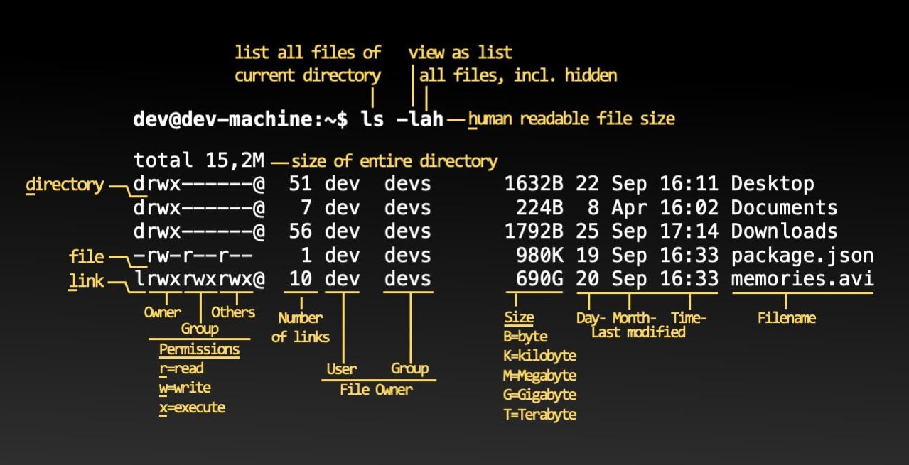

# Linux Command Line Notes

## File System and Navigation


### Directories Shortcuts
- `~` : Home directory
- `.` : Current directory
- `..` : Previous directory
- `-` : Last opened directory

### Basic Navigation Commands
- **Change Directory**: `cd`
- **List files**: `ls`

  
  

## User Management and Privileges

- **Switch User**: `su`
- **Execute command with Superuser Privileges**: `sudo`
- **Change the password**: `passwd <username>`
- **Adding user**: `useradd -m newuser` (-m creates home directory)

## File Permissions and Ownership

### chmod: Change file permissions

```bash
chmod [<SET><ACTION><PERMISSIONS>]... FILE
```

Example: `chmod u+x hello.sh`

**Set**
- `u`: User (owner)
- `g`: Group
- `o`: Others
- `a`: All (user, group, and others)

**Action**
- `+`: Add permission
- `=`: Set exact permission
- `-`: Remove permission

**Permissions**
- `r`: Read
- `w`: Write
- `x`: Execute

### chown: Change file ownership

```bash
sudo chown [OPTIONS] [OWNER] FILE
```

Example: `sudo chown root hello.sh`

## File Operations

- **Concatenation**: `cat [OPTIONS] [FILE]`
- **View from top**: `head [-n LINES] FILE`
- **View from bottom**: `tail [-n LINES] FILE`
- **Copy files**: `cp [OPTIONS] SOURCE DESTINATION`
- **Copy at bit level**: `dd`
- **Move/Rename files**: `mv SOURCE DESTINATION`
- **Remove file/directory**: 
  - `rm FILE`
  - `rm -r DIRECTORY`
  - `rm -rf DIRECTORY` (use with extreme caution)
- **Text filter**: `grep [OPTIONS] PATTERN FILE`

## System Operations

- **Shutdown**: `shutdown [OPTIONS] TIME [MESSAGE]`
- **Network commands**: `ifconfig`, `iwconfig`
- **Verify connection**: `ping [-c COUNT] HOST`
- **View processes**: `ps [OPTIONS]`

## Package Management

### Debian-based Systems (apt/apt-get)

- Update package list: `sudo apt-get update`
- Upgrade packages: `sudo apt-get upgrade`
- Search for package: `apt-cache search PACKAGE`
- Install package: `sudo apt-get install PACKAGE`
- Remove package:
  - Keep config: `sudo apt-get remove PACKAGE`
  - Remove config: `sudo apt-get purge PACKAGE`

### Red Hat-based Systems
- RHEL: `yum`
- Fedora: `dnf`

## Environment Variables

- **Print environment variable**: `printenv`
- **Print shell variable**: `echo $VARIABLE`
- **Set shell variable to environment**: `export VARIABLE`
- **Unset environment variable**: `export -n VARIABLE`
- **Unset shell variable**: `unset VARIABLE`

## Shell Options

- **Enable POSIX mode**: `set -o posix`

## Control Shortcuts

- Move to start of line: `Ctrl + A`
- Move to end of line: `Ctrl + E`
- Reverse search through history: `Ctrl + R`

## History Commands

- Run specific command from history: `!NUMBER`
- Run last occurrence of a command: `!COMMAND`
- Run previous command with `sudo`: `sudo !!`

### History Control

#### HISTCONTROL
- `ignorespace`: Ignore commands starting with space
- `ignoredups`: Ignore repeated commands
- `erasedups`: Remove all duplicate entries and only keep the latest one

#### HISTIGNORE
- Ignore specific commands: `HISTIGNORE="COMMAND"`
- Multiple ignored commands: `HISTIGNORE="COMMAND1:COMMAND2:..."`

## File Matching

- `*`: Any number of characters
- `?`: Matches one character
- `[]`: One character in the list, e.g., `[0-9a-zA-Z]`
- `!`: Negates the match
- `{,}`: Expands to multiple matches

## Bash Shell Usage

### Meta Characters
- `$`: Value of a variable
- `''`: Raw string
- `""`: Allows variable expansion
- `\`: Escape character

### Path Management
- Push directory to stack: `pushd PATH`
- Pop directory from stack: `popd +NUMBER`
- List all paths in stack: `dirs`
- Change to a directory from stack: `cd ~NUMBER`

### Command Substitution
- `$(COMMAND)` or `` `COMMAND` ``

## Pipes and Redirection

### Pipes
- Unnamed pipe: `|`
- Named pipe: `mkfifo PIPE_NAME`

### Redirection
- Redirect stdout: `>`
- Append stdout: `>>`
- Redirect stderr: `2>`
- Append stderr: `2>>`
- Redirect both stdout and stderr: `&>`
- Append both stdout and stderr: `&>>`
- Show and save output: `tee` (use `tee -a` to append)

## Process Management

### Viewing Processes
- `ps`: Show processes
  - `-e`: Show every process
  - `-f`: Full options
  - `-F`: Extra options (memory, CPU, etc.)
  - `-l`: Long format
- Custom format: `ps -e --format uid,pid,ppid,%cpu,cmd`
- Sort by CPU usage: `ps -e --format uid,pid,ppid,%cpu,cmd --sort %cpu`

### Real-time Process Monitoring
- `top`: Real-time process viewer
  Options (press key):
  - `l`: Show/hide load average/uptime
  - `1`: Show CPU cores
  - `t`: Toggle between different displays
  - `space`: Select process

### Process Identification
- Get process ID: `pidof PROCESS_NAME` or `pgrep PROCESS_NAME`

### Terminating Processes
- Kill process by ID: `kill PROCESS_ID`
- Kill all processes by name: `killall PROCESS_NAME`